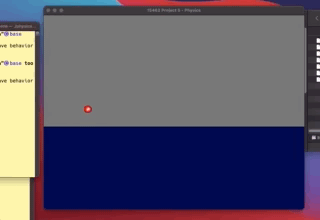
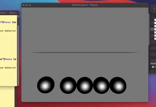
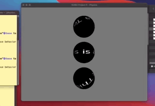
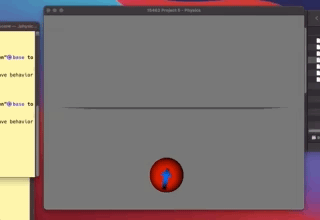
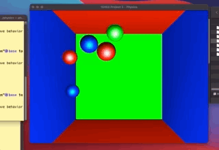
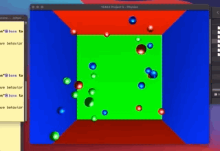

# Simple Physics Engine

This repo contains my attempt at programming a simple physics engine.

The major tasks done :

- Implemented collisions between sphere to sphere, sphere to triangle, and sphere to plane collisions

- Implemented simulation of both velocity and angular velocity for spheres along with force and torque

- Implemented Runge-Kutta 4th Order to integrate bodies

- Implemented spring interactions between bodies.

- Added gravity (It is mentioned as a static const in physics class)

- Implemented damping for both Collision and Spring class.

## Resources

Starter Code : [Physics Engine](http://www.cs.cmu.edu/afs/cs/academic/class/15462-f12/www/project/p5.tar.gz)

Project Details : [pdf](http://www.cs.cmu.edu/afs/cs/academic/class/15462-f12/www/project/p5.pdf)

## Getting Started

After downloading the .tar.gz file, you can unzip 
```
tar -xzvf p5.tar.gz
cd p5out
```
and read the README file for furthuer instructions guiding you through the task.

To build the project you need to install few dependencies
1. SDL
2. libpng
3. GLEW

If you are usin Mac OS then follow along.

Brew (Homebrew) is very handy while installing libraries. Using brew we can start installing the requirements.
```
$ brew install sdl
$ brew install glew
```

The starter code isn't compatible with newer versions of *libpng*.
Hence, we'll be using libpng12 for our project.

Here, the link for [libpng-1.2.59.tar.gz](https://sourceforge.net/projects/libpng/files/libpng12/1.2.59/libpng-1.2.59.tar.gz/download). 

Once done downloading we'll unpack the file into /lib folder and install there.

```
$ tar -xzvf libpng-1.2.59.tar.gz
$ cd libpng-1.2.59
$ make
$ make install
$ sudo ln -s . /usr/local/libpng
```

Now you can compile the project by executing `make` in the project directory. 

-----------

## Results











